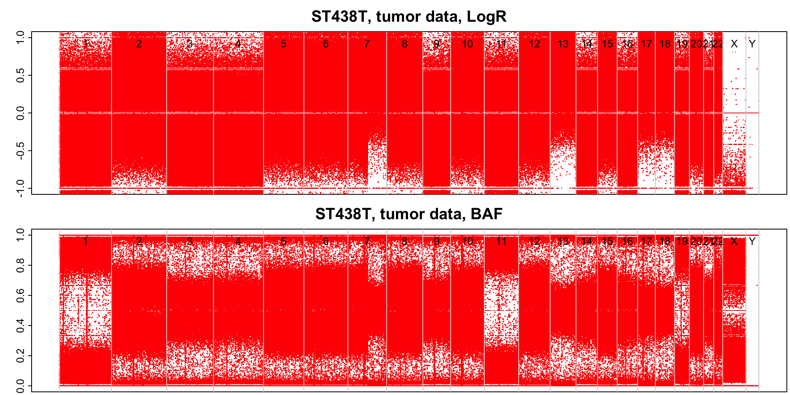
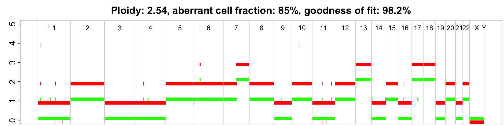

#ASCAT
Ascat is a software for performing allele-specific copy number analysis of tumor samples and for estimating tumor ploidy and purity (normal contamination). Ascat is written in R and available here: https://github.com/Crick-CancerGenomics/ascat    
To run Ascat on NGS data we need .bam files for the tumor and normal samples, as well as a loci file with SNP positions.  
If Ascat is run on SNP array data, the loci file contains the SNPs on the chip. When runnig Ascat on NGS data we can use the same loci file, for exampe the one corresponding to the AffymetrixGenome-Wide Human SNP Array 6.0, but we can also choose a loci file of our choice with i.e. SNPs detected in the 1000 Genomes project.  
###BAF and LogR values  
Running Ascat on NGS data requires that the .bam files are converted into BAF and LogR values. This can be done using the software AlleleCount (https://github.com/cancerit/alleleCount) followed by a simple R script. AlleleCount extracts the number of reads in a bam file supporting each allele at specified SNP positions. Based on this, the BAF and logR can be calculated as   
BAFi(tumor)=countsBi(tumor)/(countsAi(tumor)+countsBi(tumor))
BAFi(normal)=countsBi(normal)/(countsAi(normal)+countsBi(normal))
LogRi(tumor)=log ((countsAi(tumor)+countsBi(tumor)/(countsAi(normal)+countsBi(normal)) - median(countsA(tumor)+countsB(tumor))
LogRi(normal)=0
Where i corresponds to the list of SNPs in the loci file. 
CountsA and CountsB are vectors containing number of reads supporting the A and B alleles of all SNPs 
A = the major allele 
B = the minor allele 
Minor and major alleles are defined in the loci file (it actually doesn't matter which one is defied as A and B in this application). 
###Loci file
The loci file was created based on the 1000Genomes latest release (phase 3, releasedate 20130502), available here:  
ftp://ftp.1000genomes.ebi.ac.uk/vol1/ftp//release/20130502/ALL.wgs.phase3_shapeit2_mvncall_integrated_v5b.20130502.sites.vcf.gz  
The following filter was applied: Only bi-allelc SNPs with minor allele frequencies > 0.3
The filtered file is stored on Milou in:
```
/sw/data/uppnex/ToolBox/ReferenceAssemblies/hg38make/bundle/2.8/b37/1000G_phase3_20130502_SNP_maf0.3.loci
```
###Run AlleleCount
To run Ascat we first need to convert .bam files to allele counts. This is done using the software AlleleCount. 
AlleleCount was installed in Malins home directory on Milou:
```
$ cd /home/malin
 $ git clone https://github.com/cancerit/alleleCount
 $ cd alleleCount
 $ module load bioinfo-tools
 $ module load samtools
 $ ./setup.sh /home/malin/
 ```
This added the executable file alleleCounter in /home/malin/bin. This folder is included in my $PATH so I can run it anywhere on Milou by typing:
```
$ alleleCounter
```
Note - other users must either install AlleleCount themselves or point to my installation.
To run AlleleCount on the sample ST438N:
```
$ salloc -A projectID -p core -n 5:00:00
 salloc: Pending job allocation 7409264
 ...
 $ module load bioinfo-tools
 $ module load samtools
 $ LOCIFILE=/sw/data/uppnex/ToolBox/ReferenceAssemblies/hg38make/bundle/2.8/b37/1000G_phase3_20130502_SNP_maf0.01.loci
 $ REFERENCE=/sw/data/uppnex/ToolBox/ReferenceAssemblies/hg38make/bundle/2.8/b37/human_g1k_v37.fasta
 $ alleleCounter -l $LOCIFILE -r $REFERENCE -b sample.bam -o sample.allecount
```
The above code (and some additional logistics) has been implemented in the script "run_allelecount.sh" and included in Malins git repository for somatic variant calling at https://malinlarsson@bitbucket.org/malinlarsson/somatic_wgs_pipeline.git. 
To start an sbatch job that runs allele counter for one particular .bam file:
```
sbatch -A projectID -p core -n 4 -t 240:00:00 -J jobname -o allelecounter.out -e allelecounter.err /path/to/somatic_wgs_pipeline/run_allelecount.sh sample.bam /path/to/somatic_wgs_pipeline/configfile.sh
```
###Convert allele counts to LogR and BAF values
First, run AlleleCount as described above on the tumor and normal bam files.
The allele counts can then be converted into LogR and BAF values acceding to the formulas above using the script "convertAlleleCounts.r". The script is available in the same git repository (https://malinlarsson@bitbucket.org/malinlarsson/somatic_wgs_pipeline.git). 
To run the script type for example (for a male sample, Gender = "XY"):
```
sbatch -A b2011185 -p core -n 2 -t 240:00:00 -J convertAllelecounts -e convertAllelecounts.err -o convertAllelecounts.out /path/to/somatic_wgs_pipeline/convertAlleleCounts.r tumor_sample tumor.allelecount normal_sample normal.allelecount XY
```
This creates the BAF and LogR data for the tumor and normal samples, to be used as input to ASCAT.
###Run ASCAT
To run ASCAT in the simplest possible way without compensating for the local CG content across the genome, the script "run_ascat.r" can be used. (Included in the same git repository).
```
run_ascat.r tumor_baf tumor_logr normal_baf normal_logr
```
#First results
Here are the first ASCAT results from the analysis of whole genome data of an arbitrary tumor - normal pair. 
The tumor data was sequenced to ~60 x coverage and the normal sample was sequenced to ~30 x coverage. 
BAF and LogR plot in the tumor sample: 

BAF and LogR plot in the normal sample:

Note - the tumor LogR values are normalized against the normal LogR values before Log transformation, whcih sets the normal LogR to zero at all positions. 
As you can see in the plot, there is a wide range of BAF values from ~0.2 to ~0.8 in the normal sample. For heterozygous SNPs BAF is expected to be close to 0.5. It is likely that the relatively low covarage in the normal sample (30 x) is contributing to this effect. We will try to filter the input data so that for example only positions that are covered by > 25-30 reads are used, and see if it reduces the noice. 

Below is the output from ASCAT. ASCAT predicts that the analyzed sample has a tumor purity of 85%, and an average ploidy of 2.54. The Goodness of fit is 98.2%. 
We will discuss the results further with the PIs. 



